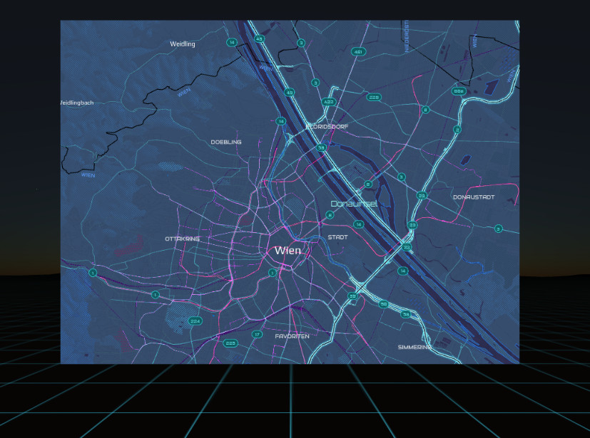

## aframe-tangram-component

A [Mapzen Tangram](https://mapzen.com/products/tangram/) component for [A-Frame](https://aframe.io).

> Supports A-Frame 0.7.0.



### API

#### `tangram-map` component

The geojson component has the `material` and `geometry` components as a dependency from the entity. It implements a raycaster logic that fires an event if a GeoJSON feature gets selected.

##### Schema
| Property | Description | Default Value |
| -------- | ----------- | ------------- |
| apiKey | Sets the global API key of the Tangram map. May be empty if the style needs no API. | "" |
| style | The style definition document for the ovleray style. Must point to a custom style or to a [basemap style](https://nextzen.org). | "" |
| center | Center of the map, in the form of [longitude, latitude] | [0, 0] |
| zoom | The zoom level of the map. | 13 |
| pxToWorldRatio | The multiplication factor between meters in A-Frame and the pixels of the map. ie; when set to 100, will display 100 pixels per 1 meter in world space. (see [a note on fidelity](#a-note-on-fidelity)) | 100 |
| highDensityDisplay | Flag if the _devicePixelRatio_ property should be considered. Mobile devices may have a high ppd so the output texture size may be 3 times as high as on desktop which may lead to crash of the browser | false |

##### Events
| Name | Data | Description |
| -------- | ----------- | ------------- |
| tangram-map-loaded | None| Fired when the map has finished loading. |
| tangram-map-moveend | None | Fired when the map parameters have been changed and the map has reloaded. |

##### API
| Name | Data | Description |
| -------- | ----------- | ------------- |
| project | _lon_, _lat_| Returns the pixel x and y coordinates of the given longitude and latitude. |
| unproject | _x_, _y_| Gives the longitude and latitude of the pixel coordinates. |
| getMap | | Returns the _Leaflet_ instance to work programmatically with the map. |

### Styling
The Mapzen Tangram are styled within a (set) of YAML files or ZIP files. See the [Tangram documentation](https://mapzen.com/documentation/tangram/) for details. 
You can also directly load the prefabed styles provided by [Mapzen](https://mapzen.com/documentation/cartography/styles/)

### A note on fidelity

The higher `pxToWorldRatio`, the more map area will be displayed per world
unit. That canvas has to be translated into a plane in world space. This is
combined with the width and height in world space (from geometry.width and
geometry.height on the entity) to set up the plane for rendering in 3D.

The map is rendered as a texture on a 3D plane. For best performance, texture
sizes should be kept to powers of 2. Keeping this in mind, you should work to
ensure `width * pxToWorldRatio` and `height * pxToWorldRatio` are powers of 2.

### Dependencies
The Mapzen styling documents are in the YAML format, so you need a possiblity to require those files.
If you are using _Webpack_ install
`npm install yml-loader --save-dev` 
and configure the webpack configuration file

If you are using browserify install the
`nmp install yamlify --save-dev` 
and give pass the transform (-t) parameter to browserify.

### Installation

#### Browser

Install and use by directly including the [browser files](dist):

```html
<head>
  <title>My A-Frame Scene</title>
  <script src="https://aframe.io/releases/0.7.0/aframe.min.js"></script>
  <script src="https://unpkg.com/aframe-tangram-component/dist/aframe-tangram-component.min.js"></script>
</head>

<body>
  <a-scene>

      <a-tangram-map 
        position="0 0 -2"
        width="7"
        height="5"
        api-key="mapzen-tDHBHDp"
        map-style="#zip-style"
        center="16, 48"
        zoom="12"
        px-world-ratio="100"
        >
      </a-tangram-map>
  </a-scene>
</body>
```

<!-- If component is accepted to the Registry, uncomment this. -->
<!--
Or with [angle](https://npmjs.com/package/angle/), you can install the proper
version of the component straight into your HTML file, respective to your
version of A-Frame:

```sh
angle install aframe-tangramgeojson-component
```
-->

#### npm

Install via npm:

```bash
npm install aframe-tangram-component
```

Then require and use.

```js
require('aframe');
require('aframe-tangram-component');
```

#### Required step for Webpack
To get the import working you need to tell _Webpack_ not to parse the _Tangram_ library otherwise you will run into [this error](https://github.com/tangrams/tangram/issues/559). So you need to add this in your _webpack.config.js_.

```js
module: {
    noParse: [/tangram\/dist\/tangram/],
}
```

See also [here](https://github.com/tangrams/tangram-play/wiki/Advanced-Tangram-for-front-end-engineers:-bundlers,-frameworks,-etc) for more information.

### Known issues
* Dynamic maps are not support yet.

### Notes
* I am not working at Mapzen, this is a personal project.
* API strongly influenced from the [A-Frame Mapbox component](https://github.com/jesstelford/aframe-map)
